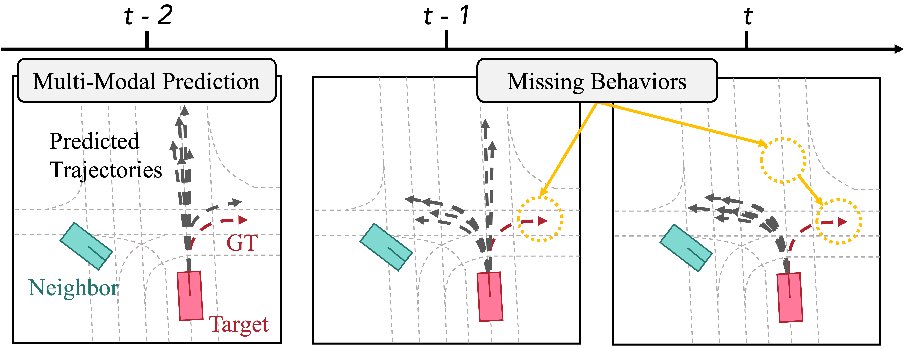
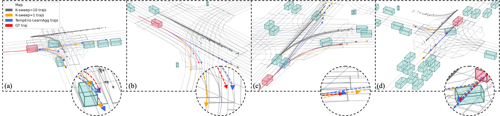

# TempEnsLearnAgg - Multi-Modal Motion Prediction using Temporal Ensembling with Learning-based Aggregation

**[2024/05/22]** The [model checkpoint]((https://drive.google.com/drive/folders/17ksxYqP1HRV_mIUrKLb-wSljavdUmiz_?usp=drive_link)) is released. Give it a try!  

## Highlights

* This paper introduces Temporal Ensembling with Learning-based Aggregation, a meta-algorithm designed to mitigate the issue of missing behaviors in trajectory prediction, where accurately predicted trajectories are absent, leading to inconsistent predictions across consecutive frames.

**Step 1**: clone this repository:

```
git clone git@github.com:KaiYin77/TempEnsLearnAgg-qcnet.git && cd TempEnsLearnAgg-qcnet
```

**Step 2**: create a conda environment and install the dependencies:
```
conda env create -f environment.yml
conda activate TempEns
```
Alternatively, you can configure the environment in your favorite way. Installing the latest version of [PyTorch](https://pytorch.org/), [PyG](https://pyg.org/), and [PyTorch Lightning](https://lightning.ai/pytorch-lightning/) should work well.

**Step 3**: install the [Argoverse 2 API](https://github.com/argoverse/av2-api) and download the [Argoverse 2 Motion Forecasting Dataset](https://www.argoverse.org/av2.html) following the [Argoverse 2 User Guide](https://argoverse.github.io/user-guide/getting_started.html).

## Prerequisite
**Step 1**: download the pretrained base model weights and structure files as shown below : [Download Link](https://drive.google.com/drive/folders/1CctnRBY4z1ijzZBaGzuqgNBWdJe9EPTj?usp=sharing)

```
.
├── ...
└──pretrain
    ├── QCNet_AV2.ckpt
    └── TempEnsLearnAgg_AV2.ckpt
```
## Training

```
python train.py --dataset argoverse_v2 --model TempEnsLearnAgg \
    --root data/argoverse_v2_qcnet/ --ckpt_path ./pretrain/QCNet_AV2.ckpt \
    --train_batch_size 4 --val_batch_size 4 --test_batch_size 4 \
```
**Note 1**: when running the training script for the first time, it will take several hours to preprocess the data.

**Note 2**: during training, the checkpoints will be saved in `lightning_logs/` automatically. 

**Note 3**: you can adjust the batch size and the number of devices. To reproduce the results, you should ensure the total batch size to be 32. 

## Evaluation

```
python evaluate.py --model TempEnsLearnAgg --root /data/argoverse_v2_qcnet/ --ckpt_path ./pretrain/TempEnsLearnAgg_AV2.ckpt
```

### Visualization

```
python visualize.py --model TempEnsLearnAgg --root data/argoverse_v2_qcnet/ --ckpt_path ./pretrain/TempEnsLearnAgg_AV2.ckpt
```

## Qualitative Results




