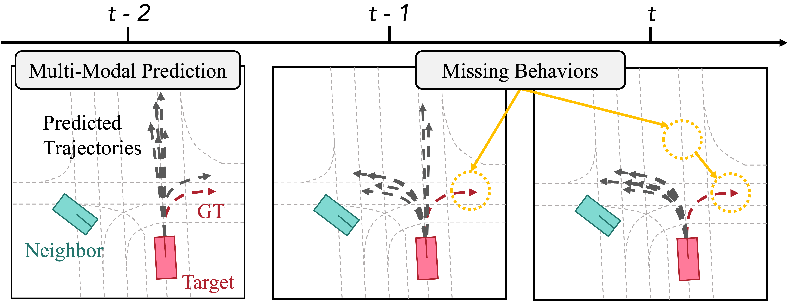
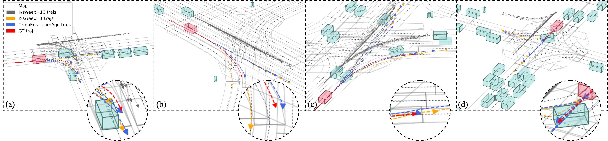

# TempEnsLearnAgg - Multi-Modal Motion Prediction using Temporal Ensembling with Learning-based Aggregation

## Highlights

* This paper introduces Temporal Ensembling with Learning-based Aggregation, a meta-algorithm designed to mitigate the issue of missing behaviors in trajectory prediction, where accurately predicted trajectories are absent, leading to inconsistent predictions across consecutive frames.

**Step 1**: create a conda environment and install the dependencies:
```
conda env create -f environment.yml
conda activate TempEns
```

**Step 2**: install the [Argoverse 2 API v0.2.0](https://github.com/argoverse/av2-api) 


First install rust compiler
```
curl --proto '=https' --tlsv1.2 -sSf https://sh.rustup.rs | sh
```

Make sure to adjust your PATH as:
```
export PATH=$HOME/.cargo/bin:$PATH
```

We use the nightly release of Rust for SIMD support. Set it as your default toolchain:
```
rustup default nightly
```

Then, install av2:
```
pip install git+https://github.com/argoverse/av2-api.git@v0.2.0#egg=av2
```

**Step 3**: Make sure the tiny data is placed at

```
.
├── ...
└──data
    └── argoverse_v2
```

**Step 4**: download the pretrained base model weights and structure files as shown below : [Download Link](https://drive.google.com/drive/folders/1CctnRBY4z1ijzZBaGzuqgNBWdJe9EPTj?usp=sharing)

```
.
├── ...
└──pretrain
    ├── QCNet_AV2.ckpt
    └── TempEnsLearnAgg_AV2.ckpt
```

**Step 5**: run the visualization script
```
python visualize.py --model TempEnsLearnAgg --root data/argoverse_v2/ --ckpt_path ./pretrain/TempEnsLearnAgg_AV2.ckpt

or

./visualize.sh
```

## Qualitative Results




